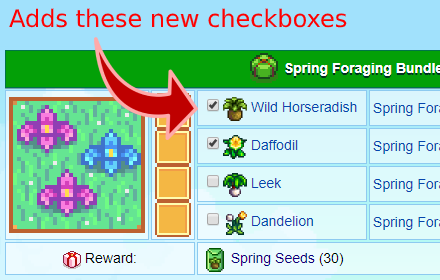

# Stardew Bundle Checkboxes
This is an extension that will add checkboxes to the [stardew valley bundles wiki page](https://stardewvalleywiki.com/Bundles). Use it to keep track of what you've turned in on the same page that tells you how to collect the items (and shows all the items on one screen). The checkboxes will stay checked if you close the tab or reload the page.

# Photo

# Install
The chrome webstore does a manual review of extensions and it usually takes 2-3 days. In my experience, it's usually closer to 3. I'll add a link when it goes through but for now you can just follow these instructions:

1. Download stardew.zip
2. Navigate to chrome://extensions (if you're lazy like me you can just type chrome:extensions)
3. Enable the "Developer mode" radio button in the top right
4. Drag the zip folder onto the page. The extension should show up within a second or two. If that doesn't work, unzip the folder and click "Load unpacked", then select the unzipped folder (the one that contains the file manifest.json).
5. Reload the page and the checkboxes will be there!
